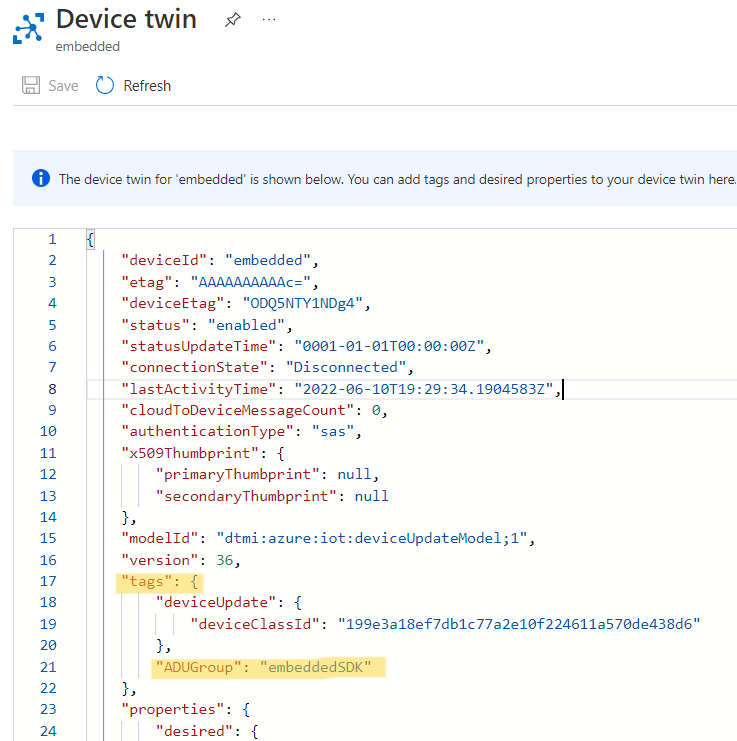

# How to Setup and Run Azure SDK for Embedded C ADU on Espressif ESP32

> ## Before you proceed
> 
>_This sample is based on the Azure IoT SDK for C, uses a bare metal (no RTOS) approach and has support for Arduino IDE._
> 
>_There is a different sample for the ESP32 with the Azure IoT middleware for FreeRTOS (requires FreeRTOS to work)._
> 
> _If this is what you’re looking for please visit  [this GitHub repo](https://github.com/Azure-Samples/iot-middleware-freertos-samples/blob/main/README.md)_.

- [Introduction](#introduction)
  - [What is Covered](#what-is-covered)
- [Prerequisites](#prerequisites)
- [Add Azure IoT Hub Device to an ADU Deployment Group](#add-azure-iot-hub-device-to-an-adu-deployment-group)
- [Device Setup Instructions](#device-setup-instructions)
- [New Image Instructions](#new-image-instructions)
  - [Generate the ADU Update Manifest](#generate-the-adu-update-manifest)
  - [Import the Update Manifest](#import-the-update-manifest)
  - [Deploy Update](#deploy-update)
  - [Monitor the Update Process](#monitor-the-update-process)
- [Certificates - Important to know](#certificates---important-to-know)
  - [Additional Information](#additional-information)
- [Troubleshooting](#troubleshooting)
- [Contributing](#contributing)
  - [License](#license)

## Introduction

This is a "to-the-point" guide outlining how to run an Azure SDK for Embedded C ADU sample on an ESP32 microcontroller. The command line examples are tailored to Debian/Ubuntu environments.

### What is Covered

- Configuration instructions for the Arduino IDE to compile a sample using the [Azure SDK for Embedded C](https://github.com/Azure/azure-sdk-for-c).
- Setting up and configuring the necessary services for the scenario.
- Configuration, build, and run instructions for the IoT ADU sample.

_The following was run on Windows 11, with Arduino IDE 2.1.0 and ESP32 board library version 2.0.9._

## Prerequisites

- Have an [Azure account](https://azure.microsoft.com/) created.
- Have an [Azure IoT Hub](https://docs.microsoft.com/azure/iot-hub/iot-hub-create-through-portal) created.
  > Important: To use Azure Device Update you must have an Azure IoT Hub with [scale unit](https://learn.microsoft.com/azure/iot-hub/iot-hub-scaling) S1, S2, S3. This sample will not work with a Azure IoT Hub 'Basic' scale unit or free tier. 
- Have an [Azure Device Update](https://docs.microsoft.com/azure/iot-hub-device-update/create-device-update-account?tabs=portal) instance created and linked to your Azure IoT Hub.
- Have a logical device created in your Azure IoT Hub: using authentication type "Symmetric Key" or "X.509 self-signed".   
  - **Symmetric Key**: follow [this guidance](https://docs.microsoft.com/azure/iot-hub/iot-hub-create-through-portal#register-a-new-device-in-the-iot-hub) to create a device.In this case, the device keys are used to automatically generate a SAS token for authentication.
  - **X.509 self-signed cert**: Instructions on how to create an X.509 cert for tests can be found [here](https://github.com/Azure/azure-sdk-for-c/blob/main/sdk/samples/iot/docs/how_to_iot_hub_samples_linux.md#configure-and-run-the-samples) (Step 1). Please note that you might need to install some of the [prerequisites](https://github.com/Azure/azure-sdk-for-c/blob/main/sdk/samples/iot/docs/how_to_iot_hub_samples_linux.md#prerequisites) like OpenSSL.
- Have the latest [Arduino IDE](https://www.arduino.cc/en/Main/Software) installed.

- Have the [ESP32 board support](https://github.com/espressif/arduino-esp32) installed on Arduino IDE.

  - ESP32 boards are not natively supported by Arduino IDE, so you need to add them manually.
  - Follow the [instructions](https://github.com/espressif/arduino-esp32) in the official ESP32 repository.
  - If your ESP32 board is not recognized and a COM port is not mapped by your computer, try installing the [serial port drivers](https://docs.espressif.com/projects/esp-idf/en/latest/esp32/get-started/establish-serial-connection.html#connect-esp32-to-pc) recommended by ESPRESSIF.
- Install Azure CLI and Azure IoT Module

  See steps to install both [here](https://learn.microsoft.com/azure/iot-hub-device-update/create-update?source=recommendations#prerequisites).

## Add Azure IoT Hub Device to an ADU Deployment Group

Add the `"ADUGroup"` tag to the device's top-level twin document. This is used to group devices together, and you may choose whichever tag you prefer (e.g., "embeddedSDK").

```json
"tags": {
    "ADUGroup": "<your-tag-here>"
},
```

Viewing the device twin on the portal, the "tag" section should look similar to the following. Don't worry if you do or do not have a `"deviceUpdate"` section in the `"ADUGroup"` tag. ADU adds that as a default group.




## Device Setup Instructions

1. Run the Arduino IDE.

1. Install the Azure SDK for Embedded C library.

    - On the Arduino IDE, go to menu `Sketch`, `Include Library`, `Manage Libraries...`.
    - Search for and install `azure-sdk-for-c`.
    - **Make sure to install version `1.1.0` or later to use the new Azure Device Update client of the Embedded C SDK.**

1. Open the ESPRESSIF ESP32 sample.

    - On the Arduino IDE, go to menu `File`, `Examples`, `azure-sdk-for-c`.
    - Click on `Azure_IoT_Adu_ESP32` to open the sample.

1. Configure the ESPRESSIF ESP32 sample.

    Enter your Azure IoT Hub and device information into the sample's `iot_configs.h`:
    - Add your Wi-Fi SSID to `IOT_CONFIG_WIFI_SSID`
    - Add your Wi-Fi password to `IOT_CONFIG_WIFI_PASSWORD`
    - Add you IoTHub Name to `IOT_CONFIG_IOTHUB_FQDN`
    - Add your Device ID to `IOT_CONFIG_DEVICE_ID`
    - If using **X.509 Cert**:
        - Uncomment the `#define IOT_CONFIG_USE_X509_CERT`
        - Add your cert to `IOT_CONFIG_USE_X509_CERT`
        - Add your cert PK to `IOT_CONFIG_DEVICE_CERT_PRIVATE_KEY`
    - If using **Symmetric Key**:
        - Add your device key to `IOT_CONFIG_DEVICE_KEY`

1. Connect the ESP32 microcontroller to your USB port.

    After connecting the device,

    - Go to menu `Tools`, `Board` and select `ESP32`.
    - Go to menu `Tools`, `Port` and select the port to which the microcontroller is connected.

1. Select the appropriate partition scheme for your device. Go to `Tools` -> `Partition Scheme` -> `Minimal SPIFFS`.

1. Upload the sketch.

    - Go to menu `Sketch` and click on `Upload`.

        <details><summary><i>Expected output of the upload:</i></summary>
        <p>

        ```text
        Executable segment sizes:
        IROM   : 361788          - code in flash         (default or ICACHE_FLASH_ATTR)
        IRAM   : 26972   / 32768 - code in IRAM          (ICACHE_RAM_ATTR, ISRs...)
        DATA   : 1360  )         - initialized variables (global, static) in RAM/HEAP
        RODATA : 2152  ) / 81920 - constants             (global, static) in RAM/HEAP
        BSS    : 26528 )         - zeroed variables      (global, static) in RAM/HEAP
        Sketch uses 392272 bytes (37%) of program storage space. Maximum is 1044464 bytes.
        Global variables use 30040 bytes (36%) of dynamic memory, leaving 51880 bytes for local variables. Maximum is 81920 bytes.
        /home/user/.arduino15/packages/esp8266/tools/python3/3.7.2-post1/python3 /home/user/.arduino15/packages/esp8266/hardware/esp8266/2.7.1/tools/upload.py --chip esp8266 --port /dev/ttyUSB0 --baud 230400 --before default_reset --after hard_reset write_flash 0x0 /tmp/arduino_build_826987/azure_iot_hub_telemetry.ino.bin
        esptool.py v2.8
        Serial port /dev/ttyUSB0
        Connecting....
        Chip is ESP8266EX
        Features: WiFi
        Crystal is 26MHz
        MAC: dc:4f:22:5e:a7:09
        Uploading stub...
        Running stub...
        Stub running...
        Changing baud rate to 230400
        Changed.
        Configuring flash size...
        Auto-detected Flash size: 4MB
        Compressed 396432 bytes to 292339...

        Writing at 0x00000000... (5 %)
        Writing at 0x00004000... (11 %)
        Writing at 0x00008000... (16 %)
        Writing at 0x0000c000... (22 %)
        Writing at 0x00010000... (27 %)
        Writing at 0x00014000... (33 %)
        Writing at 0x00018000... (38 %)
        Writing at 0x0001c000... (44 %)
        Writing at 0x00020000... (50 %)
        Writing at 0x00024000... (55 %)
        Writing at 0x00028000... (61 %)
        Writing at 0x0002c000... (66 %)
        Writing at 0x00030000... (72 %)
        Writing at 0x00034000... (77 %)
        Writing at 0x00038000... (83 %)
        Writing at 0x0003c000... (88 %)
        Writing at 0x00040000... (94 %)
        Writing at 0x00044000... (100 %)
        Wrote 396432 bytes (292339 compressed) at 0x00000000 in 13.0 seconds (effective 243.4 kbit/s)...
        Hash of data verified.

        Leaving...
        Hard resetting via RTS pin...
        ```

        </p>
        </details>

1. Monitor the MCU (microcontroller) locally via the Serial Port.

    - Go to menu `Tools`, `Serial Monitor`.

        If you perform this step right away after uploading the sketch, the serial monitor will show an output similar to the following upon success:

        ```text
        1970/1/1 00:00:41 [INFO] WiFi connected, IP address: 192.168.1.123
        1970/1/1 00:00:41 [INFO] Setting time using SNTP
        ....
        2022/11/2 20:56:20 [INFO] Time initialized!
        2022/11/2 20:56:20 [INFO] ------------------------------------------------------------------------------
        2022/11/2 20:56:20 [INFO] ADU SAMPLE
        2022/11/2 20:56:20 [INFO] Version: 1.0
        2022/11/2 20:56:20 [INFO] ------------------------------------------------------------------------------
        2022/11/2 20:56:20 [INFO] Client ID: mydeviceid
        2022/11/2 20:56:20 [INFO] Username: myiothub.azure-devices.net/mydeviceid/?api-version=2020-09-30&DeviceClientType=c%2f1.4.0-beta.1(ard;esp32)&model-id=dtmi%3Aazure%3Aiot%3AdeviceUpdateModel%3B1
        2022/11/2 20:202256/11/2: 20:56:2020 [INFO]  [INFO] MQTT event MQTT_EVENT_BEFORE_CONNECT
        MQTT client started
        2022/11/2 20:56:20 [INFO] Requesting all device properties
        2022/11/2 20:56:20 [INFO] Client requesting device property document from service.
        2022/11/2 20:56:27 [INFO] MQTT event MQTT_EVENT_CONNECTED
        ```


## New Image Instructions

In order to update our device, we have to build the image which our device will update to. We will have to direct the Arduino IDE to specify an output directory so that we can easily find the binary. Open the `preferences.txt` (find its path going to menu `File`, `Preferences`) and add `build.path=C:\Arduino-output` (or whichever directory you prefer), then restart the Arduino IDE.

Once you are done with the ADU sample, you may remove the added configuration to restore the build output to its original location.

1. Update the image version in the sketch configuration

    - In `iot_configs.h`, change the `ADU_DEVICE_VERSION` to version 1.1.

1. Click on "Verify" to build the update image.

    Once the build is complete, you should then have a file called `Azure_IoT_Adu_ESP32.ino.bin` in your output directory. Copy that file to a new directory `C:\ADU-update`, and rename it `Azure_IoT_Adu_ESP32_1.1.bin`

### Generate the ADU Update Manifest

Open PowerShell.

Navigate to the `C:\ADU-update` directory.

Run the following command:

```powershell
az iot du update init v5 --update-provider Contoso --update-name ESP32-Embedded --update-version 1.1 --compat deviceModel=ESP32-Embedded deviceManufacturer=ESPRESSIF --step handler=microsoft/swupdate:1 properties='{\"installedCriteria\":\"1.1\"}' --file path=./Azure_IoT_Adu_ESP32_1.1.bin > ./Contoso.ESP32-Embedded.1.1.importmanifest.json
```

Verify you have the following files in your ADU-update directory:

- `Azure_IoT_Adu_ESP32_1.1.bin`
- `Contoso.ESP32-Embedded.1.1.importmanifest.json`

### Import the Update Manifest

To import the update (`Azure_IoT_Adu_ESP32_1.1.bin`) and manifest (`Contoso.ESP32-Embedded.1.1.importmanifest.json`), follow the instructions at the link below:

- [Import Update and Manifest](https://docs.microsoft.com/azure/iot-hub-device-update/import-update)


### Deploy Update

To deploy the update to your ESP32, follow the link below:

- [Deploy Update](https://docs.microsoft.com/azure/iot-hub-device-update/deploy-update)

### Monitor the Update Process

  In Arduino IDE, go to menu `Tools`, `Serial Monitor`.

  Once the update request is received by the device, a log similar to this should be displayed:

  ```text
  2022/11/3 05:25:32 [INFO] Client received a properties topic.
  2022/11/3 05:25:32 [INFO] Status: 200
  2022/11/3 05:25:32 [INFO] Message Type: Desired Properties
  2022/11/3 05:25:32 [INFO] Parsed Azure device update manifest.
  2022/11/3 05:25:32 [INFO] [JWS] Calculated manifest SHA matches parsed SHA
  2022/11/3 05:25:32 [INFO] Manifest authenticated successfully
  2022/11/3 05:25:32 [INFO] Sending manifest property accept
  ...
  ```

  And once the update is complete (including the device automatic reboot), the new version should be printed:

  ```text
  2022/11/3 05:26:22 [INFO] ------------------------------------------------------------------------------
  2022/11/3 05:26:22 [INFO] ADU SAMPLE
  2022/11/3 05:26:22 [INFO] Version: 1.1
  2022/11/3 05:26:22 [INFO] ------------------------------------------------------------------------------
  ```

## Certificates - Important to know

The Azure IoT service certificates presented during TLS negotiation shall be always validated, on the device, using the appropriate trusted root CA certificate(s).

The Azure SDK for C Arduino library automatically installs the root certificate used in the United States regions, and adds it to the Arduino sketch project when the library is included.

For other regions (and private cloud environments), please use the appropriate root CA certificate.

### Additional Information

For important information and additional guidance about certificates, please refer to [this blog post](https://techcommunity.microsoft.com/t5/internet-of-things/azure-iot-tls-changes-are-coming-and-why-you-should-care/ba-p/1658456) from the security team.

## Troubleshooting

- The error policy for the Embedded C SDK client library is documented [here](https://github.com/Azure/azure-sdk-for-c/blob/main/sdk/docs/iot/mqtt_state_machine.md#error-policy).
- File an issue via [Github Issues](https://github.com/Azure/azure-sdk-for-c/issues/new/choose).
- Check [previous questions](https://stackoverflow.com/questions/tagged/azure+c) or ask new ones on StackOverflow using the `azure` and `c` tags.

## Contributing

This project welcomes contributions and suggestions. Find more contributing details [here](https://github.com/Azure/azure-sdk-for-c/blob/main/CONTRIBUTING.md).

### License

Azure SDK for Embedded C is licensed under the [MIT](https://github.com/Azure/azure-sdk-for-c/blob/main/LICENSE) license.
