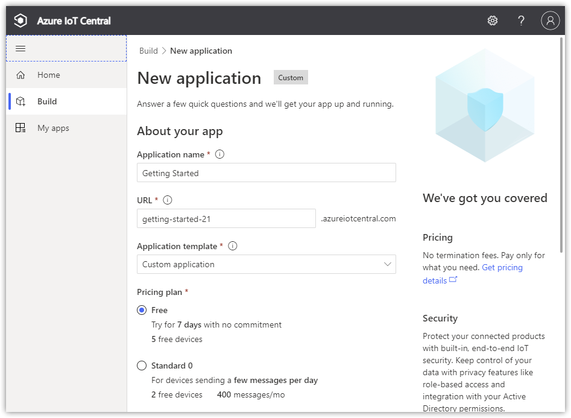
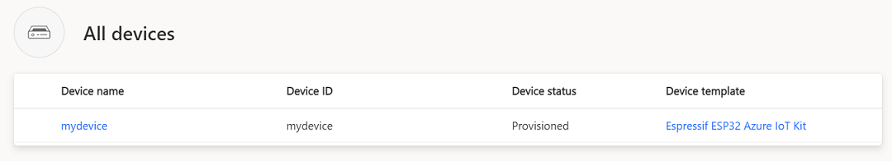
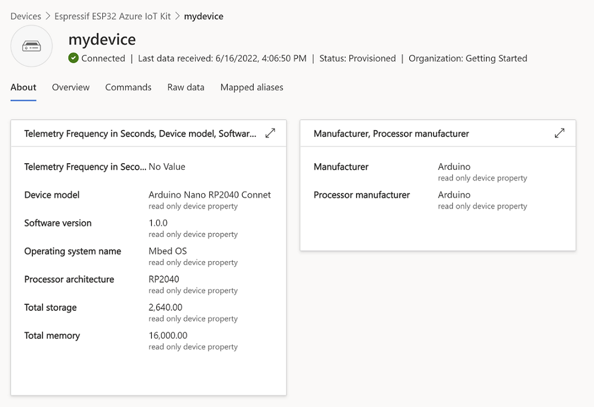
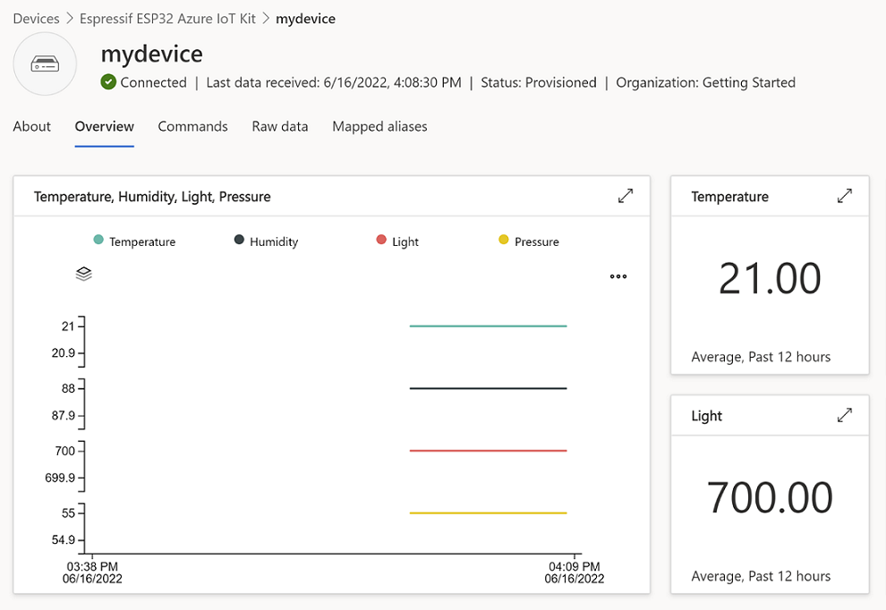

# Getting started with the Arduino Nano RP2040 Connect and Azure IoT Central with Azure SDK for C Arduino library

**Total completion time**:  30 minutes

- [Getting started with the Arduino Nano RP2040 Connect and Azure IoT Central with Azure SDK for C Arduino library](#getting-started-with-the-arduino-nano-rp2040-connect-and-azure-iot-central-with-azure-sdk-for-c-arduino-library)
  - [Introduction](#introduction)
    - [What is Covered](#what-is-covered)
  - [Prerequisites](#prerequisites)
  - [IoT Central and Device Setup](#iot-central-and-device-setup)
    - [Create the IoT Central Application](#create-the-iot-central-application)
    - [Create a new device](#create-a-new-device)
  - [Arduino IDE Setup](#arduino-ide-setup)
  - [Run the Sample](#run-the-sample)
  - [View your device data from IoT Central](#view-your-device-data-from-iot-central)
    - [Verify the device status](#verify-the-device-status)
    - [View device information](#view-device-information)
    - [View telemetry](#view-telemetry)
    - [Send a command](#send-a-command)
    - [Clean up resources](#clean-up-resources)
  - [Certificates - Important to know](#certificates---important-to-know)
    - [Additional Information](#additional-information)
  - [Troubleshooting](#troubleshooting)
  - [Contributing](#contributing)
    - [License](#license)
  
## Introduction

In this tutorial you will use the Azure SDK for C to connect the [Arduino Nano RP2040 Connect](https://docs.arduino.cc/hardware/nano-rp2040-connect) to Azure IoT Central. The article is part of the series [IoT Device Development](https://go.microsoft.com/fwlink/p/?linkid=2129824). The series introduces device developers to the Azure SDK for C, and shows how to connect several device evaluation kits to Azure IoT.

### What is Covered
You will complete the following tasks:

* Install the Azure SDK for C library on Arduino
* Build the image and flash it onto the Arduino Nano RP2040 Connect
* Use Azure IoT Central to create cloud components, view properties, view device telemetry, and call direct commands

_The following was run on Windows 10 and WSL1 Ubuntu Desktop 20.04 environments, with Arduino IDE 1.8.19 and Arduino Arduino Nano RP2040 Connect with headers._

## Prerequisites

* Have an [Azure account](https://azure.microsoft.com/) created.

* Have the latest [Arduino IDE](https://www.arduino.cc/en/Main/Software) installed.

## IoT Central and Device Setup

### Create the IoT Central Application

There are several ways to connect devices to Azure IoT. In this section, you learn how to connect a device by using Azure IoT Central. IoT Central is an IoT application platform that reduces the cost and complexity of creating and managing IoT solutions.

To create a new application:

1. Go to [Azure IoT Central portal](https://apps.azureiotcentral.com/).
1. On the left side menu, select **'My apps'**.
1. Select **'+ New application'**.
1. In the 'Custom app' box, select **'Create app'**.
1. Create a custom Application name and a URL.
1. Under 'Pricing plan', select **'Free'** to activate a 7-day trial.

    

1. Select **'Create'**.
1. After IoT Central provisions the application, it redirects you automatically to the new application dashboard.

    > Note: If you have an existing IoT Central application, you can use it to complete the steps in this article rather than create a new application.

### Create a new device

In this section, you will use the IoT Central application dashboard to create a new logical device.

To create a device:

1. On the left side menu, under 'Connect', select **'Devices'**.
1. Select **'+ New'**. A 'Create a new device' window will appear.
1. Fill in the desired 'Device name' and 'Device ID'.
1. Leave Device template as 'Unassigned'.

    

1. Select **'Create'**. The newly created device will appear in the 'All devices' list.
1. Under 'Device name', select your newly created device name.
1. In the top menu bar, select **'Connect'**. A 'Device connection groups' window will appear.

    

1. We will need the following information from this window:

    - ID scope
    - Device ID
    - Primary key

_NOTE: Device keys are used to automatically generate a SAS token for authentication, which is only valid for one hour._

## Arduino IDE Setup

1. Open the Arduino IDE.

1. Install the Azure SDK for Embedded C library.

    - Navigate to **Tools > Manage Libraries**.
    - Search for the **'azure-sdk-for-c'** library.
    - Install the latest version.

1. Install Arduino Mbed OS Nano Boards support in the Arduino IDE. [Full instructions can be found here.](https://docs.arduino.cc/hardware/nano-rp2040-connect)

    - Navigate to **Tools > Board > Boards Manager**.
    - Search for **'RP2040'** and install the **Arduino Mbed OS Nano Boards** core.
    - Install the latest version.

      *Note: This process may take several minutes.*  

1. Nagivate to **Tools > Board > Arduino Mbed OS Nano Boards** and select **'Arduino Nano RP2040 Connect'**.

1. Install WiFiNINA library for the Nano RP2040 Embedded C SDK sample.

    - Navigate to **Tools > Manage Libraries**.
    - Search for the **'WiFiNINA'** library.
    - Install the latest version.

      *Note: This process may take several minutes.*  

1. If this is your first time using the Nano RP2040 Connect, [follow these instructions to update the WiFi firmware on the Nano RP2040 Connect](https://docs.arduino.cc/tutorials/nano-rp2040-connect/rp2040-upgrading-nina-firmware).

1. Install the ArduinoBearSSL, ArduinoMqttClient, and ArduinoECCX08 libraries.

    - Navigate to **Tools > Manage Libraries**.
    - Search for the **'ArduinoBearSSL'** library. Install the latest version.
    - Search for the **'ArduinoMqttClient'** library. Install the latest version.
    - Search for the **'ArduinoECCX08'** library. Install the latest version.

1. You may need to restart the Arduino IDE for changes to show up.

## Run the Sample

1. Open the Arduino Nano RP2040 Connect sample.

    - In the Arduino IDE, navigate to **File > Examples > Azure SDK For C**
    - Select **'Azure_IoT_Central_Arduino_Nano_RP2040_Connect'** to open the sample.

1. Navigate to the '*iot_configs.h*' file

1. In the '*iot_configs.h*' file, fill in your credentials.

    - Add in your WiFi SSID and password.
    - Paste your ID Scope for the `IOT_CONFIG_DPS_ID_SCOPE` variable.
    - Paste your Device ID for the `IOT_CONFIG_DEVICE_ID` variable.
    - Finally, paste your Primary key for the `IOT_CONFIG_DEVICE_KEY` variable.

1. Connect the Arduino Nano RP 2040 Connect to your USB port.

1. On the Arduino IDE, select the port.

    - Navigate to **Tools > Port**.
    - Select the port to which the Nano RP2040 Connect is connected.

1. Upload the sketch.

    - Navigate to **Sketch > Upload**.
    
      *Note: This process may take several minutes.* 

      <details><summary><i>Expected output of the upload:</i></summary>
      <p>

      ```text
      Sketch uses 207740 bytes (1%) of program storage space. Maximum is 16777216 bytes.
      Global variables use 66812 bytes (24%) of dynamic memory, leaving 203524 bytes for local variables. Maximum is 270336 bytes.
      .
      
      ```
      
      </p>
      </details>

1. While the sketch is uploading, open the Serial Monitor to monitor the MCU (microcontroller) locally via the Serial Port.

    - Navigate to **Tools > Serial Monitor**.

        If you perform this step right away after uploading the sketch, the serial monitor will show an output similar to the following upon success:

        ```text
        2106-02-06 23:28:16 [INFO] Connecting to WIFI wifi_ssid <ssid>
        ..
        2106-02-06 23:28:16 [INFO] WiFi connected, IP address: 536923696
        2106-02-06 23:28:16 [INFO] Setting time using SNTP
        ....
        2022-06-16 16:03:03 [INFO] Time initialized!
        2022-06-16 16:03:03 [INFO] Azure IoT client initialized (state=2)
        2022-06-16 16:03:04 [INFO] MQTT Client ID: <device id>
        2022-06-16 16:03:04 [INFO] MQTT Username: <scope id>/registrations/<device id>/api-version=2019-03-31
        2022-06-16 16:03:04 [INFO] MQTT Password: ***
        2022-06-16 16:03:04 [INFO] MQTT client address: global.azure-devices-provisioning.net
        2022-06-16 16:03:04 [INFO] MQTT client port: 8883
        2022-06-16 16:03:08 [INFO] MQTT client connected.
        2022-06-16 16:03:09 [INFO] MQTT client subscribing to '$dps/registrations/res/#'
        2022-06-16 16:03:09 [INFO] MQTT topic subscribed
        2022-06-16 16:03:09 [INFO] MQTT client publishing to '$dps/registrations/PUT/iotdps-register/?$rid=1'
        2022-06-16 16:03:10 [INFO] MQTT message received.
        2022-06-16 16:03:11 [INFO] MQTT client publishing to '$dps/registrations/GET/iotdps-get-operationstatus/?$rid=1&operationId=4.36e237c8db462f45.7081bb47-3e8f-4e1e-af40-da3477582335'
        2022-06-16 16:03:11 [INFO] MQTT message received.
        2022-06-16 16:03:14 [INFO] MQTT client publishing to '$dps/registrations/GET/iotdps-get-operationstatus/?$rid=1&operationId=4.36e237c8db462f45.7081bb47-3e8f-4e1e-af40-da3477582335'
        2022-06-16 16:03:14 [INFO] MQTT message received.
        2022-06-16 16:03:15 [INFO] MQTT client being disconnected.
        2022-06-16 16:03:15 [INFO] MQTT Client ID: <device id>
        2022-06-16 16:03:15 [INFO] MQTT Username: <provisioned iot hub fqdn>.azure-devices.net/<device id>/?api-version=2020-09-30&DeviceClientType=c%2F1.3.1(ard;portentaH7)&model-id=dtmi%3Aazureiot%3Adevkit%3Afreertos%3AEsp32AzureIotKit%3B1
        2022-06-16 16:03:15 [INFO] MQTT Password: ***
        2022-06-16 16:03:15 [INFO] MQTT client address: <provisioned iot hub fqdn>.azure-devices.net
        2022-06-16 16:03:15 [INFO] MQTT client port: 8883
        2022-06-16 16:03:18 [INFO] MQTT client connected.
        2022-06-16 16:03:18 [INFO] MQTT client subscribing to '$iothub/methods/POST/#'
        2022-06-16 16:03:19 [INFO] MQTT topic subscribed
        2022-06-16 16:03:19 [INFO] MQTT client subscribing to '$iothub/twin/res/#'
        2022-06-16 16:03:19 [INFO] MQTT topic subscribed
        2022-06-16 16:03:20 [INFO] MQTT client subscribing to '$iothub/twin/PATCH/properties/desired/#'
        2022-06-16 16:03:20 [INFO] MQTT topic subscribed
        2022-06-16 16:03:20 [INFO] MQTT client publishing to '$iothub/twin/PATCH/properties/reported/?$rid=0'
        2022-06-16 16:03:20 [INFO] MQTT client publishing to 'devices/<device id>/messages/events/'
        2022-06-16 16:03:20 [INFO] MQTT message received.
        2022-06-16 16:03:20 [INFO] Properties update request completed (id=0, status=204)
        2022-06-16 16:03:29 [INFO] MQTT client publishing to 'devices/<device id>/messages/events/'
        ```

## View your device data from IoT Central

With IoT Central, you can view the device status and information, observe telemetry, and send commands.

1. Go to your [IoT Central application portal](https://apps.azureiotcentral.com/myapps).
1. Select your application.
1. On the left side menu, under 'Connect', select **'Devices'**.

### Verify the device status

To view the device status in IoT Central portal:

1. Find your device in the devices list.
1. Confirm the 'Device status' of the device is updated to 'Provisioned'.
1. Confirm the 'Device template' of the device has updated to 'Espressif ESP32 Azure IoT Kit'.

    > Note: The **'Espressif ESP32 Azure IoT Kit'** device template is used in this **Arduino Nano RP2040 Connect sample for simplicity.** It is a published template available from IoT Central. For more information on creating a custom device template, view these [instructions](https://docs.microsoft.com/en-us/azure/iot-central/core/howto-set-up-template).

    

### View device information

To view the device information in IoT Central portal:

1. Click on your device's name in the device list.
1. Select the **'About'** tab.

    

### View telemetry

To view telemetry in IoT Central portal:

1. Click on your device's name in the device list.
1. Select the **'Overview'** tab.
1. View the telemetry as the device sends messages to the cloud.

    

### Send a command

To send a command to the device:

1. Select the **'Commands'** tab.
1. Locate the 'Display Text' box.
1. In the 'Content' textbox, enter the text to be displayed on the screen.
1. Select **'Run'**.
1. Because this is a simulated screen, the text will print to the log.

    ```
    2022-06-16 13:31:50 [INFO] OLED display: <text>
    ```

To toggle an LED:

1. Select the **'Commands'** tab.
1. Locate the 'Toggle LED 1' or 'Toggle LED 2' box.
1. Select **'Run'**.
1. Because these are simulated LEDs, the following will print to the log.

    ```
    2022-06-16 13:31:46 [INFO] LED <#> state: <ON/OFF>
    ```


### Clean up resources

If you no longer need the Azure resources created in this tutorial, you can delete them from the IoT Central portal. Optionally, if you continue to another tutorial in this Getting Started guide, you can keep the resources you've already created and reuse them.

To keep the Azure IoT Central sample application but remove only specific devices:

1. On the left side menu, under 'Connect', select **'Devices'**.
1. Hover over your device's name and click on the circle that appears to the left. The circle will turn blue.
1. Select **'Delete'**. A box will appear to confirm deletion.
1. Select **'Delete'** again.

To remove the entire Azure IoT Central sample application and all its devices and resources:

1. On the left side menu, under 'Settings', select **'Application'**.
1. Select the **'Management'** tab.
1. Scroll to the bottom of the page.
1. Select **'Delete'**. A box will appear to confirm deletion.
1. Select **'Delete'** again.

## Certificates - Important to know

The Azure IoT service certificates presented during TLS negotiation shall be always validated, on the device, using the appropriate trusted root CA certificate(s).

The Azure SDK for C Arduino library automatically installs the root certificate used in the United States regions, and adds it to the Arduino sketch project when the library is included.

For other regions (and private cloud environments), please use the appropriate root CA certificate.

### Additional Information

For important information and additional guidance about certificates, please refer to [this blog post](https://techcommunity.microsoft.com/t5/internet-of-things/azure-iot-tls-changes-are-coming-and-why-you-should-care/ba-p/1658456) from the security team.

## Troubleshooting

- The error policy for the Embedded C SDK client library is documented [here](https://github.com/Azure/azure-sdk-for-c/blob/main/sdk/docs/iot/mqtt_state_machine.md#error-policy).
- File an issue via [Github Issues](https://github.com/Azure/azure-sdk-for-c/issues/new/choose).
- Check [previous questions](https://stackoverflow.com/questions/tagged/azure+c) or ask new ones on StackOverflow using the `azure` and `c` tags.

## Contributing

This project welcomes contributions and suggestions. Find more contributing details [here](https://github.com/Azure/azure-sdk-for-c/blob/main/CONTRIBUTING.md).

### License

Azure SDK for Embedded C is licensed under the [MIT](https://github.com/Azure/azure-sdk-for-c/blob/main/LICENSE) license.
