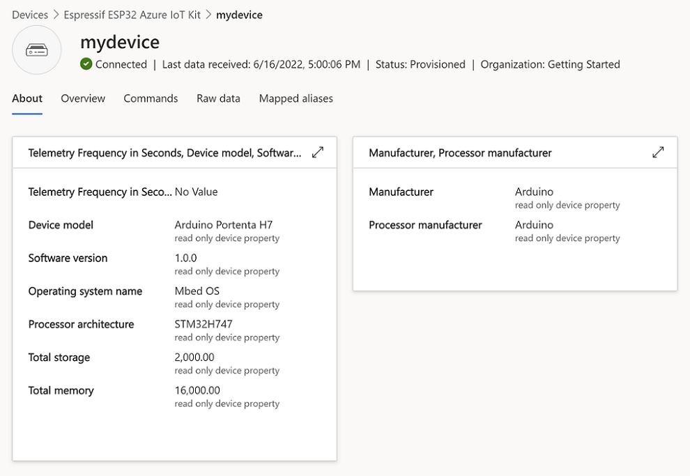

# Getting started with the Arduino Portenta H7 and Azure IoT Central with Azure SDK for C Arduino library

**Total completion time**:  30 minutes

- [Getting started with the Arduino Portenta H7 and Azure IoT Central with Azure SDK for C Arduino library](#getting-started-with-the-arduino-portenta-h7-and-azure-iot-central-with-azure-sdk-for-c-arduino-library)
  - [Introduction](#introduction)
    - [What is Covered](#what-is-covered)
  - [Prerequisites](#prerequisites)
  - [IoT Central and Device Setup](#iot-central-and-device-setup)
    - [Create the IoT Central Application](#create-the-iot-central-application)
    - [Create a new device](#create-a-new-device)
  - [Arduino IDE Setup](#arduino-ide-setup)
  - [Run the Sample](#run-the-sample)
  - [Verify the device status](#verify-the-device-status)
  - [View telemetry](#view-telemetry)
  - [Send a command on the device](#send-a-command-on-the-device)
  - [View device information](#view-device-information)
  - [Clean up resources](#clean-up-resources)
  - [Certificates - Important to know](#certificates---important-to-know)
    - [Additional Information](#additional-information)
  - [Troubleshooting](#troubleshooting)
  - [Contributing](#contributing)
    - [License](#license)
  
## Introduction

In this tutorial you will use the Azure SDK for C to connect the [Arduino Portenta H7](https://docs.arduino.cc/hardware/portenta-h7) to Azure IoT Central. The article is part of the series [IoT Device Development](https://go.microsoft.com/fwlink/p/?linkid=2129824). The series introduces device developers to the Azure SDK for C, and shows how to connect several device evaluation kits to Azure IoT.

### What is Covered
You will complete the following tasks:

* Install the Azure SDK for C library on Arduino
* Build the image and flash it onto the Arduino Portenta H7
* Use Azure IoT Central to create cloud components, view properties, view device telemetry, and call direct commands

_The following was run on Windows 10 and WSL1 Ubuntu Desktop 20.04 environments, with Arduino IDE 1.8.19 and Arduino Arduino Nano RP2040 Connect with headers._

## Prerequisites

* Have an [Azure account](https://azure.microsoft.com/) created.

* Have the latest [Arduino IDE](https://www.arduino.cc/en/Main/Software) installed.


## IoT Central and Device Setup

### Create the IoT Central Application

There are several ways to connect devices to Azure IoT. In this section, you learn how to connect a device by using Azure IoT Central. IoT Central is an IoT application platform that reduces the cost and complexity of creating and managing IoT solutions.

To create a new application:

1. Go to [Azure IoT Central portal](https://apps.azureiotcentral.com/).
1. On the left side menu, select **'My apps'**.
1. Select **'+ New application'**.
1. In the 'Custom app' box, select **'Create app'**.
1. Create a custom Application name and a URL.
1. Under 'Pricing plan', select **'Free'** to activate a 7-day trial.

    

1. Select **'Create'**.
1. After IoT Central provisions the application, it redirects you automatically to the new application dashboard.

    > Note: If you have an existing IoT Central application, you can use it to complete the steps in this article rather than create a new application.

### Create a new device

In this section, you will use the IoT Central application dashboard to create a new logical device.

To create a device:

1. On the left side menu, under 'Connect', select **'Devices'**.
1. Select **'+ New'**. A 'Create a new device' window will appear.
1. Fill in the desired 'Device name' and 'Device ID'.
1. Leave Device template as 'Unassigned'.

    

1. Select **'Create'**. The newly created device will appear in the 'All devices' list.  
1. Under 'Device name', select your newly created device name.
1. In the top menu bar, select **'Connect'**. A 'Device connection groups' window will appear.

    

1. We will need the following information from this window:

     - ID scope
     - Device ID
     - Primary key

## Arduino IDE Setup

1. Open the Arduino IDE.

1. Install the Azure SDK for Embedded C library.

    - Navigate to **Tools > Manage Libraries**.
    - Search for the **'azure-sdk-for-c'** library. 
    - Install the latest version.

1. Install Arduino Mbed OS Portenta Boards support in the Arduino IDE. [Full instructions can be found here.](https://docs.arduino.cc/software/ide-v1/tutorials/getting-started/cores/arduino-mbed_portenta)

    - Navigate to **Tools > Board > Board Manager**.
    - Search for **'Portenta'** and install the **Arduino Mbed OS Portenta Boards** core.
    - Install the latest version.    
    
      *Note: This process may take several minutes.*  

1. Nagivate to **Tools > Board > Arduino Mbed OS Portenta Boards** and select **'Arduino Portenta H7 (M7 core)'**.

1. In **Tools > Flash split**, set the flash split to be **'2MB M7 + M4 in SDRAM'**.

1. If this is your first time using the Portenta, [follow these instructions to update the WiFi firmware on the Portenta](https://support.arduino.cc/hc/en-us/articles/4403365234322-How-to-update-Wi-Fi-firmware-on-Portenta-H7).

1. Install additional libraries for the Portenta Embedded C SDK sample. 

    - This process is more involved than typical because we are using the NTP Client Generic library which has circular dependencies so we must do a special install to only grab the what we need.

    - There are two ways to do this:
        1. Download the  NTP Client Generic library manually from its repository, or
        2. Use the Arduino CLI. 

    - This tutorial will use the CLI approach because it is faster and easier to describe. 
    - Using the Arduino CLI, type and run the following command to install the NTP Client :

      ```
      arduino-cli lib install --no-deps NTPClient_Generic
      ```

    - Since we're already in the Arduino CLI, let's install remaining libraries (can also install these from Library Manager):

      ``` 
      arduino-cli lib install "Azure SDK for C" ArduinoBearSSL Time ArduinoMqttClient
      ```

1. You may need to restart the Arduino IDE for changes to show up.

## Run the Sample

1. Open the Arduino Portenta H7 sample.

    - In the Arduino IDE, navigate to **File > Examples > Azure SDK For C**
    - Select **Azure_IoT_Central_Arduino_Portenta_H7** to open the sample. 

1. Navigate to the '*iot_configs.h*' file

1. In the '*iot_configs.h*' file, fill in your credentials. 

    - Add in your WiFi SSID and password.
    - Paste your ID Scope for the  `IOT_CONFIG_DPS_ID_SCOPE` variable.
    - Paste your Device ID for the `IOT_CONFIG_DEVICE_ID` variable.
    - Finally, paste your Primary Key for the `IOT_CONFIG_DEVICE_KEY` variable.

1. Connect the Arduino Portenta H7 to your USB port.

3. On the Arduino IDE, select the port.

    - Navigate to **Tools > Port**.
    - Select the port to which the Portenta H7 is connected.

4. Upload the sketch.

    - Navigate to **Sketch > Upload**.
    
      *Note: This process may take several minutes.* 

      <details><summary><i>Expected output of the upload:</i></summary>
      <p>

      ```text
      Sketch uses 187636 bytes (1%) of program storage space. Maximum is 16777216 bytes.
      Global variables use 63492 bytes (23%) of dynamic memory, leaving 206844 bytes for local variables. Maximum is 270336 bytes.
      .
      
      ```
      
      </p>
      </details>

5. While the sketch is uploading, open the Serial Monitor to monitor the MCU (microcontroller) locally via the Serial Port.

    - Navigate to **Tools > Serial Monitor**.

        If you perform this step right away after uploading the sketch, the serial monitor will show an output similar to the following upon success:

        ```text
        TBD
        ```

## Verify the device status

To view the device status in IoT Central portal:

1. From the application dashboard, select **Devices** on the side navigation menu.
1. Check the **Device status** of the device is updated to **Provisioned**.
1. Check the **Device template** of the device has updated to **Espressif ESP32 Azure IoT Kit**.

    

## View telemetry

With IoT Central, you can view the flow of telemetry from your device to the cloud.

To view telemetry in IoT Central portal:

1. From the application dashboard, select **Devices** on the side navigation menu.
1. Select the device from the device list.
1. View the telemetry as the device sends messages to the cloud in the **Overview** tab.

    

## Send a command on the device

You can also use IoT Central to send a command to your device. In this section, you can call a command to toggle LEDs or write to the screen.

To write to the screen:

1. Select the **Command** tab from the device page.
1. Locate the **Display Text** command.
1. In the **Content** textbox, enter the text to be displayed on the screen.
1. Select **Run**. 
1. The screen on the device will update with the desired text.

To toggle an LED:

1. Select the **Command** tab from the device page.
1. Locate the **Toggle LED 1** or **Toggle LED 2** command
1. Select **Run**.
1. An LED light on the device will toggle state.


## View device information

You can view the device information from IoT Central.

Select **About** tab from the device page.


## Clean up resources

If you no longer need the Azure resources created in this tutorial, you can delete them from the IoT Central portal. Optionally, if you continue to another tutorial in this Getting Started guide, you can keep the resources you've already created and reuse them.

To keep the Azure IoT Central sample application but remove only specific devices:

1. Select the **Devices** tab for your application.
1. Select the device from the device list.
1. Select **Delete**.

To remove the entire Azure IoT Central sample application and all its devices and resources:

1. Select **Administration** > **Your application**.
1. Select **Delete**.


## Certificates - Important to know

The Azure IoT service certificates presented during TLS negotiation shall be always validated, on the device, using the appropriate trusted root CA certificate(s).

The Azure SDK for C Arduino library automatically installs the root certificate used in the United States regions, and adds it to the Arduino sketch project when the library is included.

For other regions (and private cloud environments), please use the appropriate root CA certificate.

### Additional Information

For important information and additional guidance about certificates, please refer to [this blog post](https://techcommunity.microsoft.com/t5/internet-of-things/azure-iot-tls-changes-are-coming-and-why-you-should-care/ba-p/1658456) from the security team.

## Troubleshooting

- The error policy for the Embedded C SDK client library is documented [here](https://github.com/Azure/azure-sdk-for-c/blob/main/sdk/docs/iot/mqtt_state_machine.md#error-policy).
- File an issue via [Github Issues](https://github.com/Azure/azure-sdk-for-c/issues/new/choose).
- Check [previous questions](https://stackoverflow.com/questions/tagged/azure+c) or ask new ones on StackOverflow using the `azure` and `c` tags.

## Contributing

This project welcomes contributions and suggestions. Find more contributing details [here](https://github.com/Azure/azure-sdk-for-c/blob/main/CONTRIBUTING.md).

### License

Azure SDK for Embedded C is licensed under the [MIT](https://github.com/Azure/azure-sdk-for-c/blob/main/LICENSE) license.
