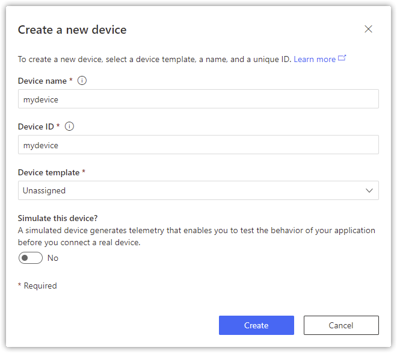

# Getting started with the ESPRESSIF ESP32 and Azure IoT Central with Azure SDK for C Arduino library

**Total completion time**:  30 minutes

In this tutorial you use the Azure SDK for C to connect the ESPRESSIF ESP32 to Azure IoT Central. The article is part of the series [IoT Device Development](https://go.microsoft.com/fwlink/p/?linkid=2129824). The series introduces device developers to the Azure SDK for C, and shows how to connect several device evaluation kits to Azure IoT.

You will complete the following tasks:

* Install the Azure SDK for C library on Arduino
* Build the image and flash it onto the ESP32
* Use Azure IoT Central to create cloud components, view properties, view device telemetry, and call direct commands

## Prerequisites

* Have the latest [Arduino IDE](https://www.arduino.cc/en/Main/Software) installed.

* Have the [ESP32 board support](https://github.com/espressif/arduino-esp32) installed on Arduino IDE.

    - ESP32 boards are not natively supported by Arduino IDE, so you need to add them manually.
    - Follow the [instructions](https://github.com/espressif/arduino-esp32) in the official ESP32 repository.

* Hardware

    > * ESPRESSIF ESP32
    > * Wi-Fi 2.4 GHz
    > * USB 2.0 A male to Micro USB male data cable

## Create the cloud components

### Create the IoT Central Application

There are several ways to connect devices to Azure IoT. In this section, you learn how to connect a device by using Azure IoT Central. IoT Central is an IoT application platform that reduces the cost and complexity of creating and managing IoT solutions.

To create a new application:

1. From [Azure IoT Central portal](https://apps.azureiotcentral.com/), select **My apps** on the side navigation menu.
1. Select **+ New application**.
1. Select **Custom apps**.
1. Add Application Name and a URL.
1. Choose the pricing plan of your preference.

    

1. Select **Create**.
1. After IoT Central provisions the application, it redirects you automatically to the new application dashboard.

    > Note: If you have an existing IoT Central application, you can use it to complete the steps in this article rather than create a new application.

### Create a new device

In this section, you use the IoT Central application dashboard to create a new device. You will use the connection information for the newly created device to securely connect your physical device in a later section.

To create a device:

1. From the application dashboard, select **Devices** on the side navigation menu.
1. Select **+ New** to bring up the **Create a new device** window.
1. Leave Device template as **Unassigned**.
1. Fill in the desired Device name and Device ID.

    

1. Select the **Create** button.
1. The newly created device will appear in the **All devices** list.  Select on the device name to show details.
1. Select **Connect** in the top right menu bar to display the connection information used to configure the device in the next section.

    

    The information provided above will create a device with **Symmetric Key** authentication. If you prefer, you can also use **X.509 certificates**. In order to do that:
     - In the `Authentication type` box, select `individual enrollment`.
     - In the `Authentication method` box, select `Certificates (X.509)`.
     - Click on the blue folder icon for both primary and secondary and select your device Certificate.

        > If needed, instructions on how to create an X.509 cert for testing can be found [here](https://github.com/Azure/azure-sdk-for-c/blob/main/sdk/samples/iot/docs/how_to_iot_hub_samples_linux.md#configure-and-run-the-samples) (Step 1). Please note that you might need to install some of the [prerequisites](https://github.com/Azure/azure-sdk-for-c/blob/main/sdk/samples/iot/docs/how_to_iot_hub_samples_linux.md#prerequisites) like OpenSSL.

1. Note the connection values for the following connection string parameters displayed in **Connect** dialog. You'll use these values during the following configuration step:

> * `ID scope`
> * `Device ID`
> * `Primary key` (only if you choose Symmetric Key authentication)


## Setup and Run Instructions

1. Run the Arduino IDE.

2. Install the Azure SDK for Embedded C library.

    - On the Arduino IDE, go to menu `Sketch`, `Include Library`, `Manage Libraries...`.
    - Search for and install `Azure SDK for C`.

3. Open the ESPRESSIF ESP32 sample.

    - On the Arduino IDE, go to menu `File`, `Examples`, `Azure SDK for C`.
    - Click on `Azure_IoT_Central_ESP32` to open the sample.

4. Configure the sample.

    Enter your Azure IoT Hub and device information into the sample's `iot_configs.h`:
    - Add your Wi-Fi SSID to `IOT_CONFIG_WIFI_SSID`
    - Add your Wi-Fi password to `IOT_CONFIG_WIFI_PASSWORD`
    - Add you Device Provisioning Scope ID to `DPS_ID_SCOPE`
    - Add your Device ID to `IOT_CONFIG_DEVICE_ID`
    - If using **X.509 Cert**:
        - Uncomment the `#define IOT_CONFIG_USE_X509_CERT`
        - Add your cert to `IOT_CONFIG_USE_X509_CERT`
        - Add your cert private key to `IOT_CONFIG_DEVICE_CERT_PRIVATE_KEY`
    - If using **Symmetric Key**:
        - Add your device key to `IOT_CONFIG_DEVICE_KEY`

5. Connect the ESP32 Azure IoT Kit microcontroller to your USB port.

6. On the Arduino IDE, select the board and port.

    - Go to menu `Tools`, `Board` and select `ESP32 Wrover Module`.
    - Go to menu `Tools`, `Port` and select the port to which the microcontroller is connected.

7. Upload the sketch.

    - Go to menu `Sketch` and click on `Upload`.

8. Monitor the MCU (microcontroller) locally via the Serial Port.

    - Go to menu `Tools`, `Serial Monitor`.

        If you perform this step right away after uploading the sketch, the serial monitor will show an output similar to the following upon success:

        ```text
        ...
        1970/1/1 00:00:03 [INFO] WiFi connected, IP address: 192.168.1.228
        1970/1/1 00:00:03 [INFO] Setting time using SNTP
        ...
        2022/1/18 23:53:17 [INFO] Time initialized!
        2022/1/18 23:53:18 [INFO] Azure IoT client initialized (state=1)
        2022/1/18 23:53:18 [INFO] MQTT client target uri set to 'mqtts://global.azure-devices-provisioning.net'
        2022/1/18 23:53:18 [INFO] MQTT client connecting.
        2022/1/18 23:53:19 [INFO] MQTT client connected (session_present=0).
        2022/1/18 23:53:19 [INFO] MQTT client subscribing to '$dps/registrations/res/#'
        2022/1/18 23:53:19 [INFO] MQTT topic subscribed (message id=48879).
        2022/1/18 23:53:19 [INFO] MQTT client publishing to '$dps/registrations/PUT/iotdps-register/?$rid=1{"modelId":"dtmi:azureiot:devkit:freertos:Esp32AzureIotKit;1"}{"registrationId":"myDeviceId","payload":{"modelId":"dtmi:azureiot:devkit:freertos:Esp32AzureIotKit;1"}}'
        2022/1/18 23:53:19 [INFO] MQTT message received.
        2022/1/18 23:53:19 [INFO] MQTT client publishing to '$dps/registrations/GET/iotdps-get-operationstatus/?$rid=1&operationId=4.8a7f95e72373290a.f936a9b2-12ff-4b7d-8189-4c250236c141'
        2022/1/18 23:53:19 [INFO] MQTT message received.
        2022/1/18 23:53:22 [INFO] MQTT client publishing to '$dps/registrations/GET/iotdps-get-operationstatus/?$rid=1&operationId=4.8a7f95e72373290a.f936a9b2-12ff-4b7d-8189-4c250236c141'
        2022/1/18 23:53:22 [INFO] MQTT message received.
        2022/1/18 23:53:22 [INFO] MQTT client being disconnected.
        2022/1/18 23:53:22 [INFO] MQTT client target uri set to 'mqtts://myProvisionedIoTHubFqdn.azure-devices.net'
        2022/1/18 23:53:22 [INFO] MQTT client connecting.
        2022/1/18 23:53:23 [INFO] MQTT client connected (session_present=0).
        2022/1/18 23:53:23 [INFO] MQTT client subscribing to '$iothub/methods/POST/#'
        2022/1/18 23:53:23 [INFO] MQTT topic subscribed (message id=556).
        2022/1/18 23:53:23 [INFO] MQTT client subscribing to '$iothub/twin/res/#'
        2022/1/18 23:53:23 [INFO] MQTT topic subscribed (message id=10757).
        2022/1/18 23:53:23 [INFO] MQTT client subscribing to '$iothub/twin/PATCH/properties/desired/#'
        2022/1/18 23:53:23 [INFO] MQTT topic subscribed (message id=15912).
        2022/1/18 23:53:23 [INFO] MQTT client publishing to '$iothub/twin/PATCH/properties/reported/?$rid=0'
        2022/1/18 23:53:23 [INFO] MQTT client publishing to 'devices/myDeviceId/messages/events/'
        2022/1/18 23:53:23 [INFO] MQTT message received.
        2022/1/18 23:53:23 [INFO] Properties update request completed (id=0, status=204)
        2022/1/18 23:53:33 [INFO] MQTT client publishing to 'devices/myDeviceId/messages/events/'
        ```

## Verify the device status

To view the device status in IoT Central portal:

1. From the application dashboard, select **Devices** on the side navigation menu.
1. Check the **Device status** of the device is updated to **Provisioned**.
1. Check the **Device template** of the device has updated to **Espressif ESP32 Azure IoT Kit**.

    

## View telemetry

With IoT Central, you can view the flow of telemetry from your device to the cloud.

To view telemetry in IoT Central portal:

1. From the application dashboard, select **Devices** on the side navigation menu.
1. Select the device from the device list.
1. View the telemetry as the device sends messages to the cloud in the **Overview** tab.

    

## Send a command on the device

You can also use IoT Central to send a command to your device. In this section, you can call a command to toggle LEDs or write to the screen.

To write to the screen:

1. Select the **Command** tab from the device page.
1. Locate the **Display Text** command.
1. In the **Content** textbox, enter the text to be displayed on the screen.
1. Select **Run**. 
1. The screen on the device will update with the desired text.

To toggle an LED:

1. Select the **Command** tab from the device page.
1. Locate the **Toggle LED 1** or **Toggle LED 2** command
1. Select **Run**.
1. An LED light on the device will toggle state.


## View device information

You can view the device information from IoT Central.

Select **About** tab from the device page.


## Clean up resources

If you no longer need the Azure resources created in this tutorial, you can delete them from the IoT Central portal. Optionally, if you continue to another tutorial in this Getting Started guide, you can keep the resources you've already created and reuse them.

To keep the Azure IoT Central sample application but remove only specific devices:

1. Select the **Devices** tab for your application.
1. Select the device from the device list.
1. Select **Delete**.

To remove the entire Azure IoT Central sample application and all its devices and resources:

1. Select **Administration** > **Your application**.
1. Select **Delete**.


## Certificates - Important to know

The Azure IoT service certificates presented during TLS negotiation shall be always validated, on the device, using the appropriate trusted root CA certificate(s).

The Azure SDK for C Arduino library automatically installs the root certificate used in the United States regions, and adds it to the Arduino sketch project when the library is included.

For other regions (and private cloud environments), please use the appropriate root CA certificate.

### Additional Information

For important information and additional guidance about certificates, please refer to [this blog post](https://techcommunity.microsoft.com/t5/internet-of-things/azure-iot-tls-changes-are-coming-and-why-you-should-care/ba-p/1658456) from the security team.

## Troubleshooting

- The error policy for the Embedded C SDK client library is documented [here](https://github.com/Azure/azure-sdk-for-c/blob/main/sdk/docs/iot/mqtt_state_machine.md#error-policy).
- File an issue via [Github Issues](https://github.com/Azure/azure-sdk-for-c/issues/new/choose).
- Check [previous questions](https://stackoverflow.com/questions/tagged/azure+c) or ask new ones on StackOverflow using the `azure` and `c` tags.

## Contributing

This project welcomes contributions and suggestions. Find more contributing details [here](https://github.com/Azure/azure-sdk-for-c/blob/main/CONTRIBUTING.md).

### License

Azure SDK for Embedded C is licensed under the [MIT](https://github.com/Azure/azure-sdk-for-c/blob/main/LICENSE) license.
